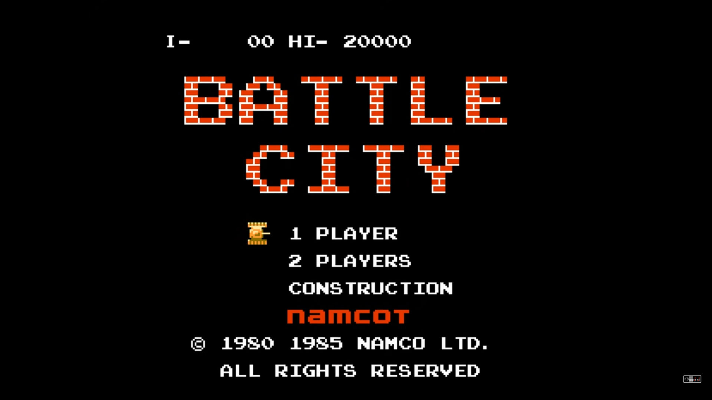
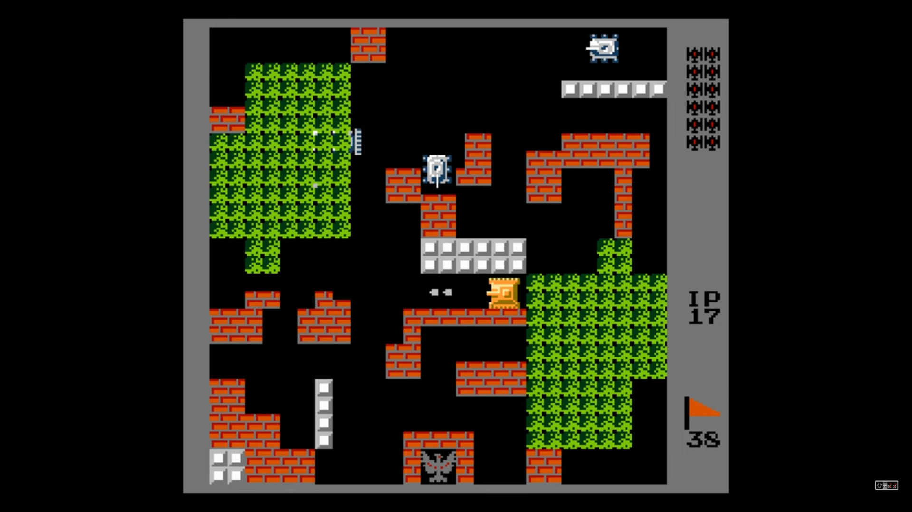

# Игра "Танчики" (Battle City / Tank N 1990)

## Краткое описание классической версии
- Могут играть 1 или 2 игрока
- 70 уровней, 35 карт 13х13 клеток (54х54 фактически с учетом характера разрушения кирпичных стен и рамки вокруг)
- 4 уровня танка игрока плюс временный бафф в виде защитного поля вокруг танка
- 4 типа вражеских танков с разными характеристиками
- 3 скорости передвижения танков
- 2 режима стрельбы, 3 скорости полёта снарядов
- 6 видов бонусов, которые можно подбирать
- 5 видов препятствий: кирпичная стена, бетонная стена, кусты, вода, лёд
- Действия игрока: поворот/движение, стрельба
- За уничтожение вражеских танков и подбор бонусов даются очки (от 100 до 500)
- Переход на новый уровень при уничтожении всех вражеских танков
- Проигрыш при разрушении штаба или потери всех жизней
- Режимы: игры, создания карты

## Базовый минимум для нашей первой демо-версии
- Однопользовательский режим
- 1 карта/уровень
- 1 уровень танка игрока
- 1 вид вражеского танка с самым базовым ИИ
- По одному свойству на каждую характеристику (стрельба/движение)
- Препятствия: только кирпичная стена

## Экраны
- Главное меню
- Выбор уровня (дополнительно)
- Заглушка с названием уровня
- Игровой режим (карта; кнопки управления для мобильной версии; доп.фичи - индикаторы: текущий уровень, жизни, остаток вражеских танков)
- Результаты после прохождения уровня
- Редактирование карты (дополнительно)

---

---

---

## Порядок разработки функционала игры

### Общее
- Ротация отвественного за ключевые части кодовой базы (1-й спринт: движок - Алексей)
- Разбивка и распределение задач через доску
- Написание документации (JS-doc в коде; в отдельной папке /docs/: game_engine)
- Коллективный лайв-кодинг - разработка движка

### Спринт 1

#### Основное
1. Отрисовка поля (создание канваса) ✅
2. Отрисовка танка по заданным координатам ✅
3. Отрисовка препятствий ✅
4. Сделать танк подвижным (нажатием клавиш на клавиатуре) ✅
5. Добавить механику столкновений ✅
6. Отрегулировать движение танков, чтобы оно шло равномерно 🚧
7. Добавить возможность стрелять (клавишами на клавиатуре) 
8. Отрисовка полёта снаряда
9. Отрисовка вспомогательных игровых экранов (загрузка, пауза, завершение)

#### Дополнительно
1. Добавление очереди игровых действий, реализация функции паузы
2. Создание кнопок управления для мобильной версии ✅❓
3. Подключение движения и стрельбы через кнопки в мобильной версии
4. Покрыть тестами функционал

### Спринт 2

#### Основное
1. Разрушение препятствий при попадании
2. Отрисовка танков противника
3. Уничтожение танков противника при попадании, начисление очков за это
4. Добавление возможности стрелять танкам противника
5. Уничтожение танка игрока при попадании
6. Отрисовка штаба/флага игрока, возможность его уничтожения
7. Механика геймовера (подсчёт очков, показ рейтинга игроков, редирект на начальный экран)
8. Добавление возможности двигаться танкам противника (программирование ИИ) ⚠️ СЛОЖНЫЙ МОМЕНТ

#### Дополнительно
1. Отрисовка индикаторов (жизни, оставшиеся вражеские танки, текущий уровень игры)
2. Подключение дополнительных элементов управления через API браузера (джостики)
3. Найти изображения игровых сущностей, добавить их в прорисовку
4. Покрыть тестами функционал

---

## Вопросы
- Насколько правильна выбранная архитектура игры с очередью действий?
- Правильно ли посчитано деление на игровые клетки?
- Нужно ли все игровые элементы делать через React?

---

## Набросок архитектуры классов со свойствами и методами

### User
    highestScore = 0; // максимально набранные очки за партию
    currentScore = 0; // очки за текущую партию
    role = 'player1' | 'player2';
    lives = 1; // жизни

### Game
    currentZone // текущая игровая зона - см. Zone
    actionsQueue = [] // очередь игровых действий: tankMove, projectileMove
    tickIntervalMs = 250; // сколько миллисекунд занимает игрой тик
    init() // загружает зону и запускает setInterval с tick()
    pause()
    resume()
    end()
    tick() // проходит по очереди игровых действий
    addScore() // обновление очков; за 20к даётся 1 жизнь

### Zone
    zoneSize = [52, 52]
    zoneMap = [[], []] // текущая карта игровой зоны
    activePlayers = []; // активные игроки
    activeEnemies = []; // активные вражеские танки
    spawnEnemyQueue // вражеские танки, которые появятся в игровой зоне
    spawnEnemyRate // темп появления вражеских танков
    spawnEnemyLimit = 4; // максимальное количество вражеских танков на поле
    findCollision(action) // проверяет на предмет столкновений при перемещении объектов
    init()
    spawnPlayer()
    spawnEnemy()
    spawnPowerUp()

### Entity
    id = '...';
    position = [x, y]; // расположение
    direction = 0 | 90 | 180 | 270; // направление движения
    size = [4, 4]; // занимаемое пространство
    health = 1 | 2 | 3 | 4; // сколько нужно выстрелов для разрушения
    movable = true | false; // может ли сущность двигаться
    crossable = true | false; // могут ли проезжать танки через сущность
    hittableByEnemies = true | false; // можно ли в сущность попасть снарядом враги
    hittableByAllies = true | false; // могут ли в сущность попасть снарядом союзники
    dispatchAction() // добавляет действие в конец actionsQueue
    spawn(coord)
    despawn()
    move()
    turn()
    takeDamage()
    render()

### Tank
    // extends Entity
    category = 'tank';
    role = 'player1' | 'player2' | 'enemy'; // игрок или враг
    spawning = true | false; // анимация появления на карте (1 секунда)
    moveSpeed = 2 | 1 | 3; // скорость передвижения
    shootSpeed = 2 | 1 | 3; // скорость выпускаемых снарядов
    shootLimit = 1 | 2; // количество снарядов, которые могут находиться в воздухе
    activeProjectiles = [Projectile]; // снаряды, которые летят
    shootPower = 1 | 2 | 3 | 4; // сила атаки - см. useShootPower()
    shootRoundType = 'normal' | 'high-explosive'; // тип снаряда - см. Projectile
    forceField = false | true; // защитное поле, даёт неуязвимость от атак
    type = 'basic' | 'fast' | 'power' | 'armor'; // типы вражеских танков - см. таблицу ниже
    flashing = false | true; // мигающий вражеский танк, уничтожение которого даёт бонус - см. PowerUp
                             // каждый 4-й, 11-й и 18-й вражеский танк появляется с flashing
    color = 'grey' | 'green' | 'yellow' // цвета для индикации жизни вражеских танков типа armor
    shoot()
    die()
    freeze()
    usePowerUp(type) // использование бонуса - см. PowerUp
    useForceField(seconds = 3 | 10) // включает защитное поле 
    setShootPower(tier) // 1: void 
                        // 2: shootSpeed = 3 
                        // 3: shootLimit = 2
                        // 4: shootRoundType = 'high-explosive'

Типы вражеских танков:
| type  | score | health | moveSpeed | shootSpeed |
|-------|-------|--------|-----------|------------|
| basic | 100   | 1      | 1         | 1          |
| fast  | 200   | 1      | 3         | 2          |
| power | 300   | 1      | 2         | 3          |
| armor | 400   | 4      | 2         | 2          |

### Projectile 
    // extends Entity
    category = 'projectile';
    speed
    role = 'player' | 'enemy'
    type = 'normal' | 'high-explosive'; // второй бьёт сразу на две клетки 
                                        // и сносит со второго удара бетонные стены 
    onImpact()

### PowerUp
    // extends Entity
    category = 'powerup'; // бонус (появляется в одном из 16-ти заданных мест)
    type =
      'grenade' // уничтожает все вражеские танки на экране
      'helmet'  // даёт защитное поле на 10 секунд
      'shovel'  // делает вокруг штаба бетонную стену
      'star'    // увеличивает силу атаки на 1
      'tank'    // даёт дополнительную жизнь
      'timer'   // замораживает вражеские танки на месте на 10 секунд
    score = 500 // очки за подбор бонуса

### Obstacle
    // extends Entity
    category = 'obstacle'; // препятствия
    type = 'brickWall' | 'conreteWall' | 'trees' | 'water' | 'ice' | 'gameBorder';
    durability = 1 | 2; // прочность (бетонную стену можно разрушить только при силе атаки 4)
    slippery = true | false; // для льда

### Flag
    // extends Obstacle
    category = 'flag'; // штаб, после разрушения которого засчитывается проигрыш
    onDamage()

### AIService

### SoundService
    type = 'init' | 'shoot' | 'move' | 'hit' | 'blast' | 'count';
    registerEvents() // подписывается на события в EventBus
    play()

## Полезные ссылки:
- https://ru.wikipedia.org/wiki/Battle_City (описание игры)
- https://strategywiki.org/wiki/Battle_City/How_to_play (описание механик игры)
- https://www.youtube.com/watch?v=Xww2jXpQSwQ (видео с прохождением игры)
- https://github.com/dogballs/cattle-bity (точный клон)
- https://github.com/hec9527/BattleCity (китайский клон с хорошей типизацией)
- https://www.youtube.com/playlist?list=PLqHlAwsJRxAPZ5LQpGfZRQjLeWIEIfX2- (видеокурс по созданию "Танчиков" на русском)
- https://github.com/olegpolyakov/battlecity (репозиторий видеокурса)
- https://www.youtube.com/@ChrisCourses (англоязычные курсы по геймдеву)
